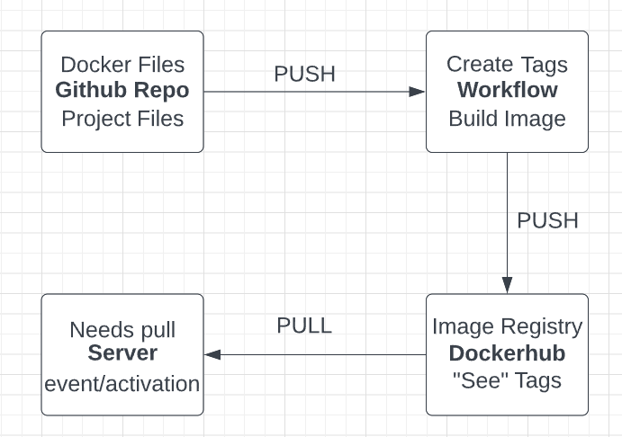

# Project 5

## Project Overview

- The goal of this project is to simulate and show github actions implementing tags, as well as up to date semantics being involved with the imaging. The second part
of the project will be to use webhooks to keep up with production.
- The reason for this project is to create a clearer understanding on the workings of github actions as well as the use of webhooks.
- Some of the tools I am going to use for this project are AWS Academy, google + any sites found using google(lol), and dockerhub (mainly desktop).

## Diagram

## Semantic Versioning

- To generate a tag in git/github, you can do it one of two main ways. First is to go to your github repo on the website, and select `release`. Then, by hitting `create a new release` and then filling out the required information, you should have a set tagname for your branch. To do it in commandline, which is what I did, you  need to use the `git tage <tagename>` command. This will set the tagname to the current branch you are working in. Tags are created locally and wont be automatically included with your push. To make the tag pushed, us the `git push origins --tag`.
- This alters the workflow of your github actions because once this is added to your actions file, you will push from github to then have your workflow check tags and branches and then push those tags to dockerhub, who will organize and show images based on those tags.
- Link to dockerhub repo: [LINK](https://hub.docker.com/repository/docker/carsonehenry/3120cicd/general)

## Deployment

- To install docker onto an instance, set the install commands inside the template file of the instance. The commands used to install docker are: `sudo get-apt update` followed by `sudo get-apt upgrade` just to make sure you are up to date. Follow these commands with with `sudo apt install docker.io`, `sudo snap install docker`, and  `sudo docker run hello-world`. Remember to add these to the commands that will be run following the creation of the instance inside the yml template file.
- The container restarting script can be found under /home/carson/3120-carsonehenry-cicd/deployment/reset.sh, obviously this is my personal computer. The script will contain the `docker container restart [OPTIONS] CONTAINER [CONTAINER...]` commmand, which will allow the container to successfully restart. This will move the container from the exited state to the running state, which it needs to be in for work to be done inside it.
- To set up and run the webhook from github (adnanh), use the `sudo snap install go` command, extract the files using `sudo tar -C /user/local -xzf go 1.18.1.linux-amd64.tar.gz`, add the PATH using `"export PATH=$PATH:/usr/local/go/bin">>.profile`. Finally, install the webhook with `go install github.com/adnanh/webhook@latest`. Following this, inside dockerhub select webhooks and in the prompt asking for a name which you will fill with your details.
- The webhook task definition file is a configuration file that describes a task that a webhook accomplishes. Information inside this file inludes things like the url and port that the webhook will run off of. The location of this file depends on the tools you used to configure your web server. I used apache2.0, so the file for me is located in `/etc/apache2`
- To configure github to message a listener, access the repo your establishing the webhook in. Go to `settings`, `webhook`, and `add webhook`. Enter the listening URL into the `payload listener` field. Add any events you want on your webhook then add the webhook to the repo.
- To configure dockerhub to message a listener, inside the dockerhub repo click on the `webhooks` tab. Click `create webhook` and inside the `callback URL`. Add any events you want for your webhook and then add the webhook to your repo.
